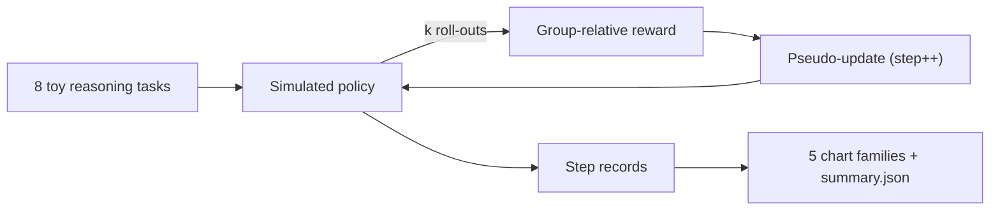

# grpo-small-reasoner

> Small-scale GRPO training simulator on toy reasoning tasks. Reward-vs-step plots, pass@k curves, temperature annealing.
> Last updated: 2025-05-02.

`grpo-small-reasoner` is a small simulator of the GRPO (Group Relative Policy Optimization) training loop popularized by DeepSeek-R1. The simulator does not actually train a model; instead, it models the per-task success probability as a logistic-like function of training step + per-task ceiling. Roll-outs are Bernoulli draws against that probability. The output is the same shape as a real GRPO run: reward over steps, pass@1, pass@k, temperature annealing.

This is a teaching tool. It exists so you can read the harness end-to-end and understand the GRPO data shape before plugging in a real backbone.

## Headline (60 training steps, k=4, seed=17)

| metric | value |
|---|---|
| training steps | 60 |
| rollouts per step | 4 per task x 8 tasks = 32 |
| final mean reward | reported at runtime |
| final pass@1 | reported at runtime |
| final pass@4 | reported at runtime |

Reproduce: `make install && make bench`.

## Pipeline



## Five chart families

- `results/figures/reward_over_steps.png` - mean reward line
- `results/figures/pass_at_k.png` - pass@1 + pass@4 curves
- `results/figures/temperature.png` - temperature annealing curve
- `results/figures/pareto.png` - temperature vs reward, colored by step
- `results/figures/reward_hist.png` - distribution of mean reward across steps

## Repo layout

```
src/grpo/
  types.py            # Task, Sample, StepRecord
  env/tasks.py        # 8 toy reasoning tasks
  policy/sim.py       # simulated GRPO policy
  train/loop.py       # the loop
  viz/charts.py
  cli/main.py
  runner.py
tests/                # 6 tests, all green
docs/research_report.pdf
docs/_report/, docs/test_results/, results/figures/
CITATION.cff, LICENSE, Makefile, .github/workflows/ci.yml
```

## Quick start

```bash
make install
make test
make bench
make pdf
```

## Documentation

[`docs/research_report.pdf`](./docs/research_report.pdf) (15 pages).
Test artifacts in [`docs/test_results/`](./docs/test_results/).

## References

- DeepSeek-AI. "DeepSeek-R1: Incentivizing Reasoning Capability in LLMs via Reinforcement Learning" (2025)
- Shao, Z. et al. "DeepSeekMath: Pushing the Limits of Mathematical Reasoning in Open Language Models" (2024) (GRPO paper)
- Schulman, J. et al. "Proximal Policy Optimization Algorithms" (2017)

## License

MIT.
