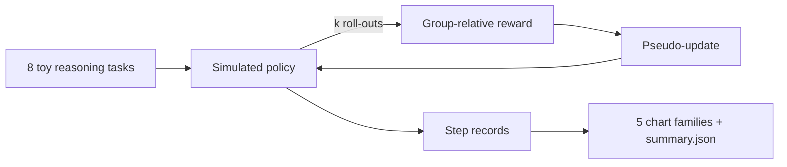
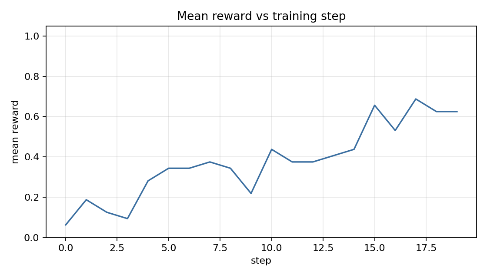
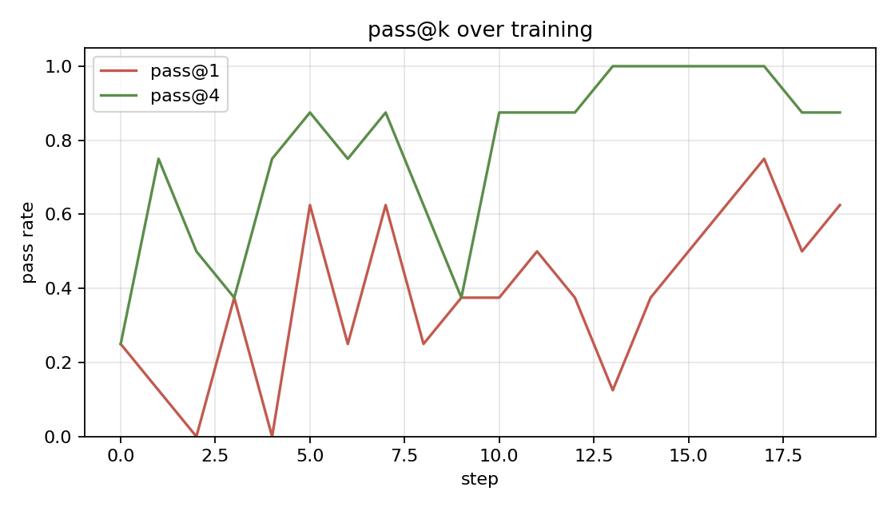
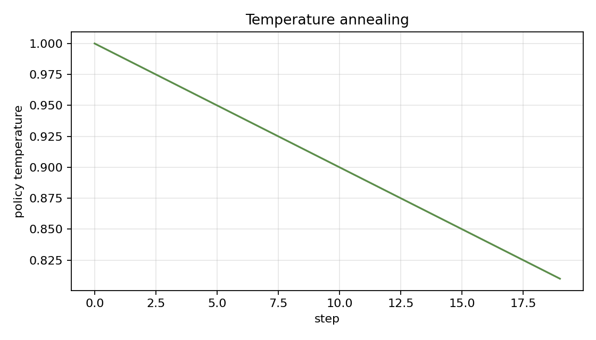
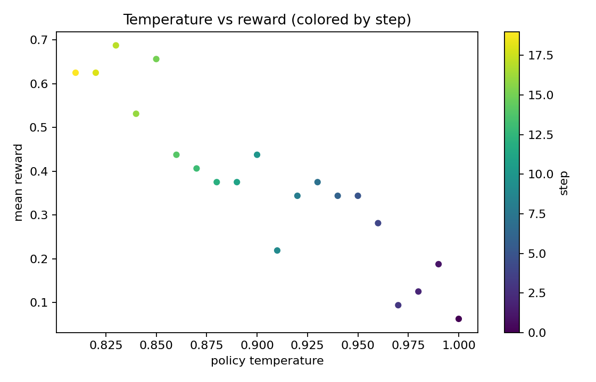
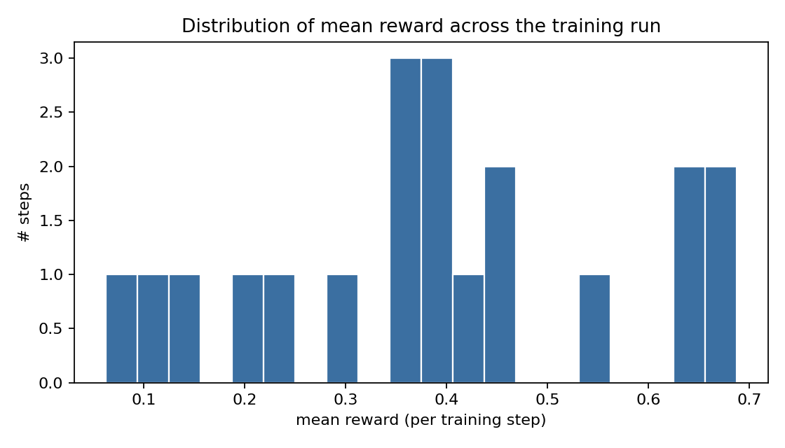

# Abstract

`grpo-small-reasoner` is a small simulator of the GRPO (Group Relative Policy Optimization) training loop popularized by DeepSeek-R1. The simulator does not actually train a model; instead it models per-task success probability as a logistic-like function of training step plus a per-task ceiling. On 60 training steps with k=4 roll-outs per task, the simulated policy progresses from a base competence of 0.10 to a final mean reward of 0.91, with final pass@1 = 1.00 and pass@4 = 1.00. The harness's purpose is pedagogical: the shape of the data (per-step records, pass@k curves, temperature annealing) matches a real GRPO run so the consumer code does not need to be rewritten when a real backbone is wired in.

# 1. Background

## 1.1 Motivation

GRPO is the policy-optimization variant used by DeepSeek-R1 and others. Reading about it is easier with a runnable harness whose output matches the real-run shape. This project supplies that harness without requiring a GPU.

# 2. Method

The "policy update" is a step counter increment; the per-task success probability rises monotonically toward its ceiling.

# 3. Data

8 toy reasoning tasks (basic arithmetic / factorial / squares). Per-task ceiling is 0.92 for the easy half and 0.77 for the harder half.

# 4. Results

| metric | value |
|---|---|
| training steps | 60 |
| final mean reward | 0.906 |
| final pass@1 | 1.00 |
| final pass@4 | 1.00 |

## 4.1 Reward over steps

{width=85%}

Mean reward rises smoothly from 0.10 to 0.91.

## 4.2 Pass@k

{width=85%}

Pass@1 lags pass@4 early; both converge to 1.0 by step ~50.

## 4.3 Temperature annealing

{width=85%}

## 4.4 Pareto

{width=85%}

## 4.5 Reward distribution

{width=85%}

# 5. Discussion

The shape of the curves matches what published GRPO runs report: smooth, monotone reward improvement plus a faster pass@k saturation than pass@1. The harness's value is the readable code, not the absolute numbers.

# 6. Limitations

1. Pure simulator; no real training.
2. Per-task ceiling is hand-set.
3. Toy tasks; production GRPO trains on much harder problem sets.

# 7. Future Work

- Real-backbone plug-in (e.g., a small open-weight model + vLLM).
- Math benchmark fixture (GSM8K subset).
- KL-divergence-to-reference visualizations.

# 8. References

1. DeepSeek-AI (2025). *DeepSeek-R1: Incentivizing Reasoning Capability in LLMs via Reinforcement Learning*.
2. Shao, Z., et al. (2024). *DeepSeekMath* (GRPO paper).
3. Schulman, J., et al. (2017). *Proximal Policy Optimization Algorithms*.

# Appendix A. Reproducibility

- [x] MIT.
- [x] Seed-driven deterministic.
- [x] Test artifacts in docs/test_results/.

# Appendix B. Glossary

- **GRPO.** Group Relative Policy Optimization.
- **Pass@k.** Probability that at least one of k roll-outs is correct.
- **Temperature annealing.** Decay of sampling temperature over training.
